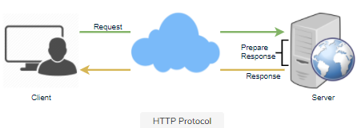
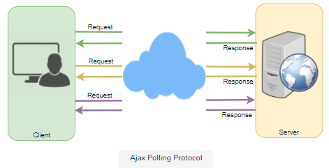
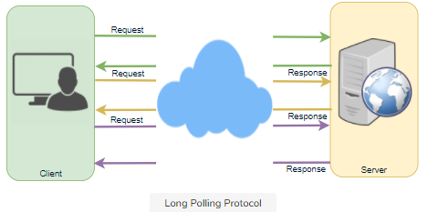
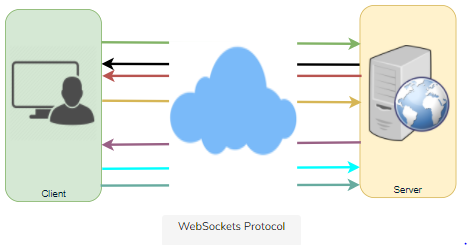
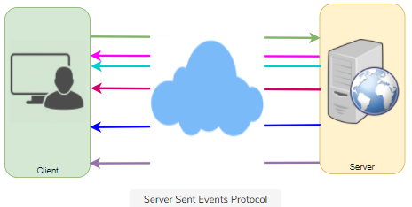

# Long-Polling vs WebSockets vs Server-Sent Events
-------------------------------------------------
###### What is the difference between Long-Polling, WebSockets, and Server-Sent Events?

We'll cover the following:
* [Ajax Polling](#what-is-consistent-hashing)
* [HTTP Long-Polling](#http-long-polling)
* [WebSockets](#websockets)
* [Server-Sent Events (SSEs)](#server-sent-events-sses)

Long-Polling, WebSockets, and Server-Sent Events are popular communication protocols between a client like 
a web browser and a web server. First, let’s start with understanding what a standard HTTP web request 
looks like. Following are a sequence of events for regular HTTP request:

1.  The client opens a connection and requests data from the server.
1.  The server calculates the response.
1.  The server sends the response back to the client on the opened request.

## Ajax Polling

Polling is a standard technique used by the vast majority of AJAX applications. The basic idea is that the client 
repeatedly polls (or requests) a server for data. The client makes a request and waits for the server to respond 
with data. If no data is available, an empty response is returned.

1.  The client opens a connection and requests data from the server using regular HTTP.
1.  The requested webpage sends requests to the server at regular intervals (e.g., 0.5 seconds).
1.  The server calculates the response and sends it back, just like regular HTTP traffic.
1.  The client repeats the above three steps periodically to get updates from the server.

The problem with Polling is that the client has to keep asking the server for any new data. As a result, a lot of 
responses are empty, creating HTTP overhead.

## HTTP Long-Polling

This is a variation of the traditional polling technique that allows the server to push information to a client 
whenever the data is available. With Long-Polling, the client requests information from the server exactly as 
in normal polling, but with the expectation that the server may not respond immediately. That’s why this 
technique is sometimes referred to as a “Hanging GET”.

* If the server does not have any data available for the client, instead of sending an empty response, the 
  server holds the request and waits until some data becomes available.
* Once the data becomes available, a full response is sent to the client. The client then immediately re-
  requests information from the server so that the server will almost always have an available waiting 
  request that it can use to deliver data in response to an event.

The basic life cycle of an application using HTTP Long-Polling is as follows:

1.  The client makes an initial request using regular HTTP and then waits for a response.
1.  The server delays its response until an update is available or a timeout has occurred.
1.  When an update is available, the server sends a full response to the client.
1.  The client typically sends a new long-poll request, either immediately upon receiving a response or after 
    a pause to allow an acceptable latency period.
1.  Each Long-Poll request has a timeout. The client has to reconnect periodically after the connection is 
    closed due to timeouts.

## WebSockets

WebSocket provides [Full duplex](https://en.wikipedia.org/wiki/Duplex_(telecommunications)#Full_duplex) communication channels over a single TCP connection. It provides a 
persistent connection between a client and a server that both parties can use to start sending data at any time. 
The client establishes a WebSocket connection through a process known as the WebSocket handshake. If the 
process succeeds, then the server and client can exchange data in both directions at any time. The WebSocket 
protocol enables communication between a client and a server with lower overheads, facilitating real-time 
data transfer from and to the server. This is made possible by providing a standardized way for the server to 
send content to the browser without being asked by the client and allowing for messages to be passed back 
and forth while keeping the connection open. In this way, a two-way (bi-directional) ongoing conversation can 
take place between a client and a server.

## Server-Sent Events (SSEs)

Under SSEs the client establishes a persistent and long-term connection with the server. The server uses this 
connection to send data to a client. If the client wants to send data to the server, it would require the use of 
another technology/protocol to do so.

1.  Client requests data from a server using regular HTTP.
1.  The requested webpage opens a connection to the server.
1.  The server sends the data to the client whenever there’s new information available.

SSEs are best when we need real-time traffic from the server to the client or if the server is generating data in 
a loop and will be sending multiple events to the client.

:back:[**Back - Consistent Hashing**](../010_Consistent_Hashing/README.md)
:arrow_right:[**Next - Cloud Storage**](../012_Cloud_Storage/README.md)

### Progress Tracker

- [x] Mark as Completed
